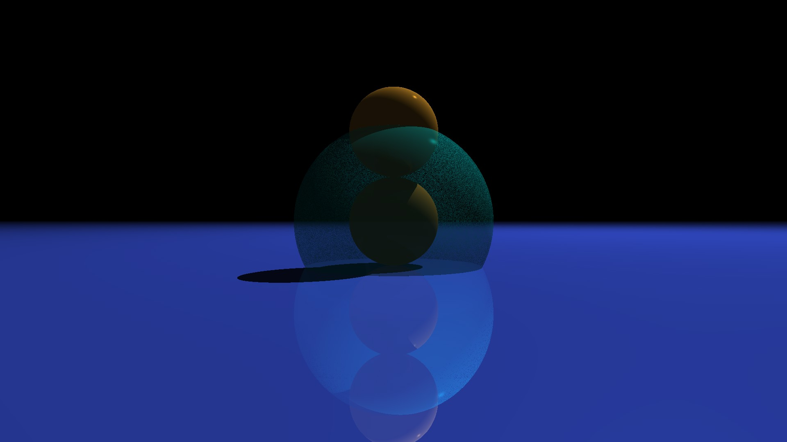

# cutrace
*A simple, parallel ray-tracing implementation in CUDA*



## Features
 - Arbitrary model loading (thanks to [Assimp](https://github.com/assimp/assimp))
 - Transparency in objects
 - Mirror objects
 - Parallel computation (one thread/pixel)

## Building and running
To build, you need to have CMake and Conan 2 installed, along with NVCC and the CUDA toolkit:
```shell
mkdir build
cd build
cmake ..
cmake --build .
```

CMake will invoke Conan to install the Asset-ImporterLib. Additionally, CMake will also fetch the picojson and stb headers.

The interface to the program is fairly simple:
```shell
build/cutrace <path to scene-json>
```

After rendering your frame, it will output three files:
 - `./depth_map.jpg`: the depth map (how far a ray had to travel until it hit an object);
 - `./normal_map.jpg`: the normal map for the hit objects (buggy, see #1);
 - `./frame.jpg`: the colored image

## Specifying scenes
See the [schema documentation](./schema.md).

## Documentation
To build the documentation, you need to have Python3 installed, as well as GNU Make and Doxygen:
```shell
cd docs
make
```

This will generate a Python venv, install the dependencies and then build the documentation into `docs/html`.

Documentation is generated by a Doxygen->Exhale->Breathe->Sphinx workflow.